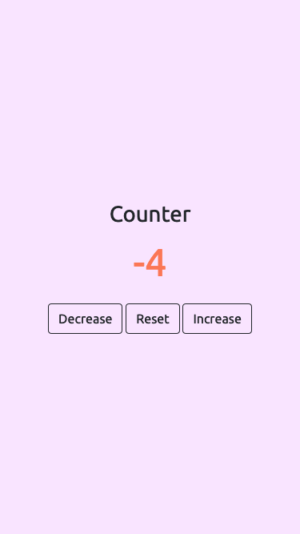
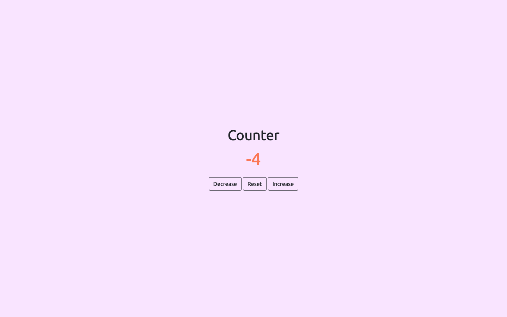

# Counter

## The Challenge

Users should be able to:

- View the optimal layout for the component depending on their device's screen size
- Press 'decrease' to decrease the number
- Press 'reset' to reset the number
- Press 'increase' to increase the number

### Screenshot

### Built with
- Semantic HTML5 markup
- Vanilla CSS
- JavaScript